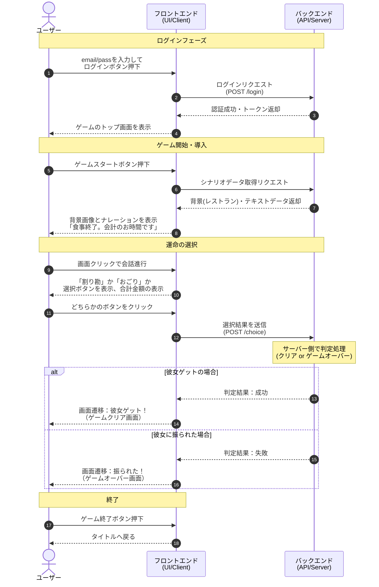

```mermaid
sequenceDiagram
    autonumber
    actor User as ユーザー
    participant FE as フロントエンド<br/>(UI/Client)
    participant BE as バックエンド<br/>(API/Server)

    Note over User, BE: ログインフェーズ
    User->>FE: email/passを入力して<br/>ログインボタン押下
    FE->>BE: ログインリクエスト<br/>(POST /login)
    BE-->>FE: 認証成功・トークン返却
    FE-->>User: ゲームのトップ画面を表示

    Note over User, BE: ゲーム開始・導入
    User->>FE: ゲームスタートボタン押下
    FE->>BE: シナリオデータ取得リクエスト
    BE-->>FE: 背景(レストラン)・テキストデータ返却
    FE-->>User: 背景画像とナレーションを表示<br/>「食事終了。会計のお時間です」

    Note over User, BE: 運命の選択
    User->>FE: 画面クリックで会話進行
    FE-->>User: 「割り勘」か「おごり」か<br/>選択ボタンを表示、合計金額の表示
    User->>FE: どちらかのボタンをクリック
    FE->>BE: 選択結果を送信<br/>(POST /choice)

    Note over BE: サーバー側で判定処理<br/>(クリア or ゲームオーバー)

    alt 彼女ゲットの場合
        BE-->>FE: 判定結果：成功
        FE-->>User: 画面遷移：彼女ゲット！<br/>（ゲームクリア画面）
    else 彼女に振られた場合
        BE-->>FE: 判定結果：失敗
        FE-->>User: 画面遷移：振られた！<br/>（ゲームオーバー画面）
    end

    Note over User, FE: 終了
    User->>FE: ゲーム終了ボタン押下
    FE-->>User: タイトルへ戻る
```